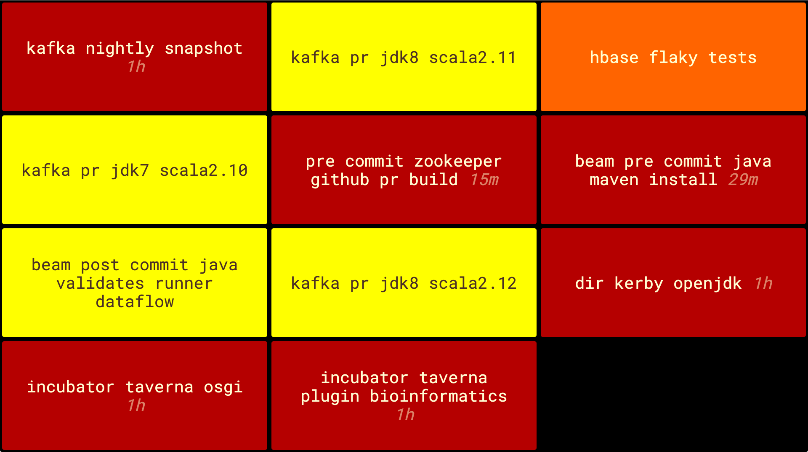

# Nevergreen

[](https://gitter.im/build-canaries/nevergreen?utm_source=badge&utm_medium=badge&utm_campaign=pr-badge&utm_content=badge)

Nevergreen is a build monitor with attitude. It is awesome for two reasons:

* Your builds should always be green. Nevergreen understands this and only shows you jobs that have failed or are building.
* Nevergreen uses HTML localStorage. So the config is stored in your web browser. You only need to run it once to host hundreds of different build monitors.

Check out the demo at [http://nevergreen.io](http://nevergreen.io).



## How to run

If your CI server is publishing it's *cctray.xml* on the web you don't need to install anything. You can just use [http://nevergreen.io](http://nevergreen.io).

If you'd like to run it yourself then you can run the jar file:

```
wget https://github.com/build-canaries/nevergreen/releases/download/v0.5.0/nevergreen-standalone.jar
java -jar nevergreen-standalone.jar
```
Nevergreen runs on port 5000 by default. You can change this with the PORT environment variable if you wish.

```
PORT=4000 java -jar nevergreen-standalone.jar
```
If you are using authentication with your CI server, it is strongly recommended to override the default AES key that Nevergreen uses to encrypt your passwords. The password must be 16bits and you can generate one [here](http://www.cryptool-online.org/index.php?option=com_cto&view=tool&Itemid=136&lang=en) ensure it is 16 characters with no special characters. Then run nevergreen as follows:

```
AES_KEY="GENERATED_KEY" java -jar nevergreen-standalone.jar
```

## Finding your CCTray xml

You can find your *cctray.xml* at these locations

 CI Server           | Location
 ------------------- | -----------------------------------------------------
 Jenkins             |  `http://jenkins.servername:8080/cc.xml`
 Hudson              |  `http://hudson.servername:8080/cc.xml`
 Travis CI           |  `http://travis-ci.org/ownername/repositoryname/cc.xml`
 GO                  |  `http://servername:8154/go/cctray.xml`
 Snap CI             |  `https://snap-ci.com/ownername/reponame/branch/master/cctray.xml`
 CircleCI            |  `https://circleci.com/cc.xml?circle-token=:circle-token`
 TeamCity            |  `http://teamcity:8111/guestAuth/app/rest/cctray/projects.xml`
 CruiseControl.rb    |  `http://cc.rb.servername:3333/XmlStatusReport.aspx`
 CruiseControl       |  `http://cc.java.servername:8080/cctray.xml`
 CruiseControl.NET   |  `http://cc.net.servername/XmlStatusReport.aspx`
 Solano CI           |  `http://api.tddium.com/cc/long_uuid_string/cctray.xml`

## Style your own monitor

If you don't like the look of our monitor page, then you can make your own from our [minimal monitor html page](doc/make-your-own.md)

## Configuring your own Nevergreen

Navigate to `http://localhost:5000`. If it is the first visit to Nevergreen from a browser then it will redirect you to `http://localhost:5000/config`.

You'll need to first put in your *cctray.xml* url then it will allow you to select which builds to show on your monitor.

## Docker

Nevergreen is also available on Dockerhub. You can access it [here](https://registry.hub.docker.com/u/buildcanariesteam/nevergreen/).

## Contributing

[](https://snap-ci.com/build-canaries/nevergreen/branch/master)

We have a [development guide](doc/contributing.md) to help you get started.

We are usually hanging out on the our [Gitter channel](https://gitter.im/build-canaries/nevergreen) if you'd like to chat.

If you would like to add a feature/fix a bug for us please create a pull request.

## License

Copyright © 2015 Build Canaries

Distributed under the Eclipse Public License either version 1.0 or (at your option) any later version.
